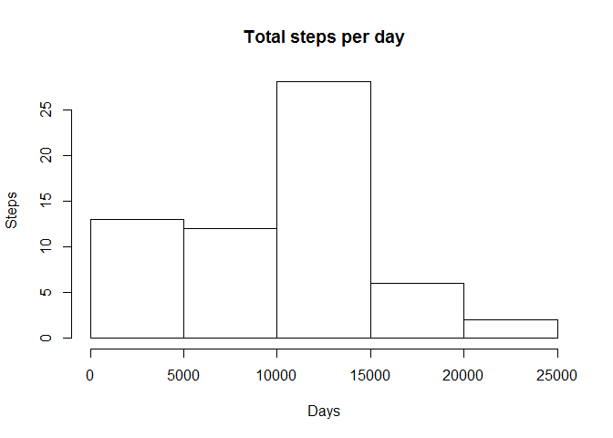
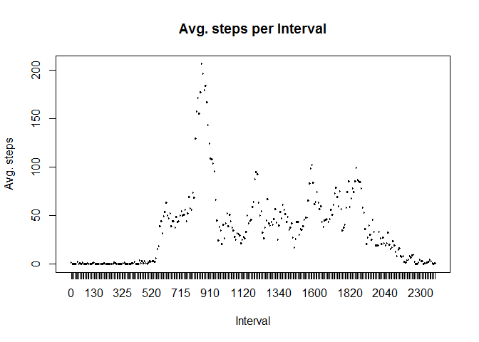
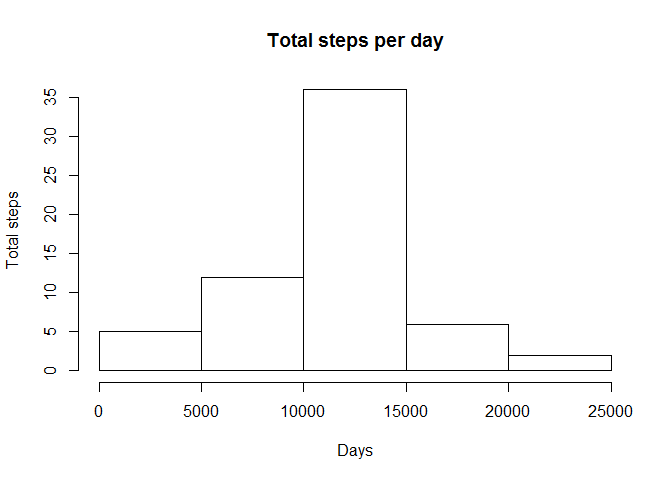
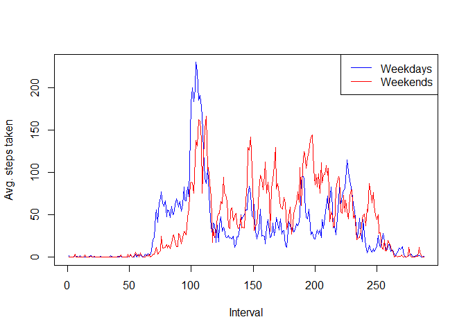

# Repro. Research Week 2 project


## Loading and preprocessing data


```r
data <- read.csv("activity.csv")
```

## What is mean total number of steps taken per day?

Remove missing values


```r
data_no_na <- data[is.na(data[,"steps"]) == FALSE,]
```

Calculate the total number of steps taken per day


```r
per_day <- data.frame(table(data_no_na[,"date"]), stringsAsFactors = FALSE)
colnames(per_day) <- c("date", "freq")

for (x in 1:nrow(per_day)) {
    per_day[x,"total_steps"] <- sum(data_no_na[data_no_na[,"date"] == per_day[x,"date"], "steps"]) 
}
```

Make a histogram of the total number of steps taken each day


```r
hist(per_day[,"total_steps"], main = "Total steps per day", xlab = "Days", ylab = "Steps")
```

<!-- -->

Calculate and report the mean and median of the total number of steps taken per day


```r
steps_mean <- mean(per_day[,"total_steps"])
steps_median <- median(per_day[,"total_steps"])
print(paste("Mean: ",steps_mean))
```

```
## [1] "Mean:  9354.22950819672"
```

```r
print(paste("Mean: ",steps_median))
```

```
## [1] "Mean:  10395"
```

## What is the average daily activity pattern?

Make a time series plot (i.e. type = "l") of the 5-minute interval (x-axis) and the average number of steps taken, averaged across all days (y-axis)


```r
per_interval <- data.frame(table(data_no_na[,"interval"]), stringsAsFactors = FALSE)
colnames(per_interval) <- c("interval", "freq")

for (x in 1:nrow(per_interval)) {
    per_interval[x,"mean_steps"] <- mean(data_no_na[data_no_na[,"interval"] == per_interval[x,"interval"], "steps"]) 
}

plot(per_interval[,"interval"], per_interval[,"mean_steps"], main="Avg. steps per Interval",
     xlab="Interval", ylab="Avg. steps")
```

<!-- -->

Which 5-minute interval, on average across all the days in the dataset, contains the maximum number of steps?


```r
max_steps <- max(per_interval[,"mean_steps"])
top_interval <- per_interval[per_interval[,"mean_steps"] == max_steps, "interval"]
print(paste("Top steps interval:", top_interval))
```

```
## [1] "Top steps interval: 835"
```

## Imputing missing values

Calculate and report the total number of missing values in the dataset 

```r
toal_nas <- nrow(data[is.na(data[,"steps"]) == TRUE,])
print(paste("Total missing values:", toal_nas))
```

```
## [1] "Total missing values: 2304"
```

Devise a strategy for filling in all of the missing values in the dataset. Create a new dataset that is equal to the original dataset but with the missing data filled in.


```r
data_mo_mv <- data

for (x in 1:nrow(data_mo_mv)) {
    
    if (is.na(data_mo_mv[x,"steps"]) == TRUE) {
        data_mo_mv[x,"steps"] <- per_interval[per_interval[,"interval"] == data_mo_mv[x,"interval"], "mean_steps"]
    }
}
```

Make a histogram of the total number of steps taken each day 

```r
per_day_2 <- data.frame(table(data_mo_mv[,"date"]), stringsAsFactors = FALSE)
colnames(per_day_2) <- c("date", "freq")

for (x in 1:nrow(per_day_2)) {
    per_day_2[x,"total_steps"] <- sum(data_mo_mv[data_mo_mv[,"date"] == per_day_2[x,"date"], "steps"]) 
}

hist(per_day_2[,"total_steps"], main = "Total steps per day", xlab = "Days", ylab = "Total steps")
```

<!-- -->

Calculate and report the mean and median total number of steps taken per day.


```r
steps_mean_2 <- mean(per_day_2[,"total_steps"])
steps_median_2 <- median(per_day_2[,"total_steps"])
print(paste("Mean: ",steps_mean_2))
```

```
## [1] "Mean:  10766.1886792453"
```

```r
print(paste("Mean: ",steps_median_2))
```

```
## [1] "Mean:  10766.1886792453"
```

Do these values differ from the estimates from the first part of the assignment?


```r
mean_dif <- steps_mean_2 - steps_mean
median_dif <- steps_median_2 - steps_median
print(paste("Mean values differ in: ",mean_dif))
```

```
## [1] "Mean values differ in:  1411.95917104856"
```

```r
print(paste("Median values differ in: ",median_dif))
```

```
## [1] "Median values differ in:  371.188679245282"
```

What is the impact of imputing missing data on the estimates of the total daily number of steps?


```r
mean_impact <- (100*mean_dif) / steps_mean
median_impact <- (100*median_dif) / steps_median
print(paste("Mean increases in",mean_impact, "%."))
```

```
## [1] "Mean increases in 15.0943396226415 %."
```

```r
print(paste("Median increases in: ",median_impact, "%."))
```

```
## [1] "Median increases in:  3.57083866517828 %."
```

## Are there differences in activity patterns between weekdays and weekends?

Create a new factor variable in the dataset with two levels - "weekday" and "weekend" indicating whether a given date is a weekday or weekend day.


```r
data_mo_mv[,"date"] <- as.Date(data_mo_mv[,"date"])
data_mo_mv[,"weekday_type"] <- weekdays(data_mo_mv[,"date"])

for (x in 1:nrow(data_mo_mv)) {
    
    if (data_mo_mv[x,"weekday_type"] == "Saturday" | data_mo_mv[x,"weekday_type"] == "Sunday" ) {
        data_mo_mv[x,"week_moment"] <- "Weekend"
    } else {
        data_mo_mv[x,"week_moment"] <- "Weekday"
    }
}

per_week_moment <- data.frame(table(data_mo_mv[,"week_moment"], data_mo_mv[,"interval"]), stringsAsFactors = false)
colnames(per_week_moment) <- c("week_moment", "interval", "freq")

for (x in 1:nrow(per_week_moment)) {
    per_week_moment[x,"mean_steps"] <- mean(data_mo_mv[data_mo_mv[,"week_moment"] == per_week_moment[x,"week_moment"] 
                                                       & data_mo_mv[,"interval"] == per_week_moment[x,"interval"], "steps"])
}
```

Make a panel plot containing a time series plot (i.e. type = "l") of the 5-minute interval (x-axis) and the average number of steps taken, averaged across all weekday days or weekend days (y-axis).


```r
week_days <- per_week_moment[per_week_moment[,"week_moment"]== "Weekday",]
week_days[,"interval"] <- as.numeric(week_days[,"interval"])
week_end <- per_week_moment[per_week_moment[,"week_moment"]== "Weekend",]
week_end[,"interval"] <- as.numeric(week_end[,"interval"])

plot(week_days[,"interval"], week_days[,"mean_steps"], type="l", col="blue",
     xlab="Interval", ylab="Avg. steps taken")
lines(week_end[,"interval"], week_end[,"mean_steps"], type="l", col="red")
legend ("topright", c("Weekdays", "Weekends"), col = c("blue", "red"), lty = 1)
```

<!-- -->

